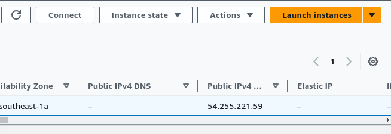

# Triển Khai Redmine Server Trên AWS-EC2
Sử dụng Terraform tạo EC2 sau đó dùng Ansible cài đặt docker cho EC2.
Sử dụng Ansible pull docker image redmine & redmine database đã đóng gói.
Kiểm tra thử thông qua port 80 ip public hoặc domain do aws cung cấp xem server Redmine đã chạy thành công chưa.
Tiến hành đóng gói backup container.
Restore bằng cách pull image trên docker hub về để kiểm tra tính toàn vẹn dữ liệu.

## Authors
 - Lớp: 20TXTH02
 - Nhóm: 04
 - Giảng Viên: Huỳnh Lê Duy Phúc
 - Thành Viên :
    |STT| Họ Tên           |MSSV        |
    |:-:| :---------------:|:----------:|
    | 1.| Hồ Như Lừng      |  2010060048|
    | 2.| Huỳnh Quang Khải |  2010060044|
    | 3.| Phạm Văn Quang   |  2010060051|
    | 4.| Lê Ngọc Trí      |  2010060038|
    | 5.| Phan Châu Pha    |  2010060061|

## Tài Nguyên
- Terraform
- Ansible
- Docker
- Git
- AWS
- Docker Registry

## Phần I. Giới Thiệu Về Các Tài Nguyên
### 1.1 Docker
#### 1.1.1 Định nghĩa
Docker là một nền tảng mở cho phát triển, vận chuyển và chạy ứng dụng.
Docker cho phép bạn tách các ứng dụng ra khỏi cơ sở hạ tầng của mình để có thể cung cấp phần mềm một cách nhanh chóng.
Với Docker, bạn có thể quản lý cơ sở hạ tầng theo cùng cách quản lý ứng dụng của mình.
Bằng cách tận dụng các phương pháp của Docker để vận chuyển, thử nghiệm và triển khai code một cách nhanh chóng, bạn có thể làm giảm đáng kể sự chậm trễ giữa việc viết code và chạy nó trong sản xuất
#### 1.1.2 Kiến trúc Docker.
Docker client trao đổi với Docker daemon thông qua REST API

Docker daemon Docker daemon (dockerd) nghe các yêu cầu từ Docker API và quản lý các đối tượng Docker như =images, containers, network và volumn. Một daemon cũng có thể giao tiếp với các daemon khác để quản lý các Docker services.

Docker registries Các Docker image có thể được đăng ký lưu trữ một cách dẽ dàng qua Docker Hub và Docker Cloud để bạn có thể đẩy lên vào kéo về dễ dàng các images.

Docker objects Khi bạn sử dụng Docker là lúc mà bạn tạo ra các images, containers, networks, volume, plugins và các other objects.

IMAGE: là các template read-only hướng dẫn cách tạo ra các Docker container. image được sử dụng để đóng gói ứng dụng và các thành phần phụ thuộc của ứng dụng. Image có thể được lưu trữ ở local hoặc trên một registry. Ví dụ ban có thể xây dựng 1 image trên ubuntu, cài Apache server , cũng như cấu hình chi tiết nhưng thứ cần thiết cho viêc running ứng dụng của bạn.

CONTAINERS: 1 Container là 1 runable instance của image. Bạn có thể create, run, stop, delete or move container sử dụng Docker API or CLI. Bạn có thể kết nối 1 hoặc nhiều network, lưu trữ nó, hoặc thậm chí tạo ra 1 image mới dựa trên trạng thái của nó. Default thì một container được cách ly tương đối với các container và host machine. Bạn có thể control được việc cách ly network, storage, hoặc các sub system khác nằm dưới các containers hoặc các host machine.

SERVICES: Service cho phép bạn mở rộng các contaners thông qua Docker daemons, chúng làm việc với nhau như 1 nhóm (swarm) với machine manager và workers. Mỗi một member của swarm là 1 daemon Docker giao tiếp với nhau bằng cách sử dụng Docker API. Theo mặc định thì service được cân bằng tải trên các nodes.

NETWORK: Cung cấp một private network mà chỉ tồn tại giữa container và host.

VOLUME: volume được thiết kể để lưu trữ các dữ liệu độc lập với vòng đời của container. Biểu đồ minh họa các lệnh phổ biến của Docker Client và mối quan hệ giữa các thành phần trên: 

### 1.2 Ansible
Việc cài đặt và cấu hình các máy chủ thường được ghi chép lại trong tài liệu dưới dạng các câu lệnh đã chạy, với giải thích kèm theo. Cách thức này gây mệt mỏi cho quản trị viên vì phải làm theo từng bước ở mỗi máy khi thiết lập mới, và có thể dẫn đến sai lầm, thiếu sót. (trích: bachkhoa-aptech)

Ansible giúp cấu hình "nhiều" server theo tùy biến rất đa dạng, giảm thiểu thời gian thao tác trên từng server được cài đặt

### 1.3 Terraform
Terraform là một công cụ mã nguồn mở hoàn toàn miễn phí được phát hành vào tháng 7 năm 2014 bởi HashiCorp. Công cụ này giúp người dùng định nghĩa và lưu trữ thông tin tài nguyên bên trong hạ tầng hệ thống của mình thông qua các file code. Từ những file code này người dùng có thể sử dụng để triển khai hạ tầng của mình trên cloud như AWS, GCP, Azure, Digital Ocean, GitHub, Cloudflare,… hay cả VMware vSphere,…
#### Đơn giản hóa việc khởi tạo và quản lý tài nguyên
Mọi thông tin về tài nguyên của hệ thống sẽ được định nghĩa trong file, điều này giúp bạn đơn giản hóa việc triển khai với nhiều bước khác nhau bằng một câu lệnh đơn giản. Ví dụ như bạn cần khởi tạo 1 con EC2 trên AWS, bạn sẽ phải vào console của EC2 và thực hiện các bước “đơn giản” sau:

Nhấn nút khởi tạo EC2
Chọn “base image”
Chọn loại EC2 bạn muốn sử dụng theo nhu cầu
Cấu hình subnet/VPC
Cấu hình Security Group
Chọn “pemkey” cho EC2 để sau này có thể SSH vào
Nhấn nút khởi tạo để AWS tiến hành tạo EC2 dựa trên các cấu hình ở bước trên
Ít nhất cũng 7 bước để có thể tạo 1 con EC2 cho bạn sử dụng. Vậy nếu như bạn tạo nhiều hơn 1 con EC2 thì sẽ như thế nào? Sẽ bao gồm 7*<số con EC2 cần tạo> bước để có thể tạo xong số lượng EC2 chúng ta cần tạo.
#### Đồng nhất quá trình triển khai và quản lý hạ tầng
Trong trường bạn đang sử dụng từ 2-3 cloud, công việc triển khai cho mỗi cloud hầu như sẽ khác nhau. Nhưng nếu sử dụng Terraform, mọi sự khác nhau sẽ được định nghĩa trên file code, việc triển khai vẫn không thay đổi. Bạn chỉ cần khai báo “provider” & tên tài nguyên tương ứng với cloud. Terraform sẽ thay bạn khởi tạo các tài nguyên trên từng cloud chỉ định. Công việc trước đây tốn hàng giờ để làm thì nay chỉ tốn vài phút là đã hoàn tất cho toàn bộ các cloud được chỉ định.
#### Cách thức hoạt động của Terraform
Terraform có thể khởi tạo và quản lý các tài nguyên thông qua các API mà “provider” (cloud/service) hỗ trợ. Các provider sẽ “mở API” cho Terraform được phép truy cập để khởi tạo và quản lý các tài nguyên. Theo số liệu chính thức được đăng tải trên trang chủ của Terraform, đã có hơn 1700 “provider” hỗ trợ Terraform trong việc quản lý hàng ngàn tài nguyên và dịch vụ. Và con số này dự kiến sẽ còn tăng trong thời gian tới.

Luồng xử lý chính của Terraform sẽ cơ bản bao gồm 3 bước sau:

- Write: đây là bước định nghĩa các tài nguyên bạn sẽ khởi tạo và quản lý vào 1 file code với định dạng file là “tf” (định dạng mặc định của Terraform).

- Plan: Terraform sẽ dựa vào file bạn viết ở bên trên để tạo ra 1 plan (kế hoạch) thực thi chi tiết. Plan này sẽ xác định các tài nguyên nào sẽ được tạo mới theo thứ tự cần thiết, các tài nguyên nào sẽ được cập nhật hoặc bị xóa dựa vào tình trạng/trạng thái hiện tại của hạ tầng mà Terraform đã ghi nhận được

- Apply: Terraform sẽ tiến hành thực thi plan với nhiều tiến trình song song. Điều này giúp tối ưu thời gian xử lý thay vì xử lý tuần tự.

Mặc định, Terraform sẽ thực thi cùng lúc 10 thao tác dựa vào plan đã được quy định. Tuy là thực thi song song nhưng sẽ vẫn thứ tự nhất định dựa vào plan đã đề ra. Ví dụ như khi bạn khởi tạo 1 EC2 và 1 Security group cho EC2 trên AWS, Terraform sẽ tiến hành tạo Security group trước khi tạo EC2.
#### Ưu điểm
- Mã nguồn mở và miễn phí
- Dễ sử dụng
- Tối ưu thời gian triển khai tài nguyên nhờ vào đa luồng
- Hỗ trợ nhiều cloud
- Dễ dàng tích hợp CI/CD
#### Nhược điểm
- Các tính năng collab và bảo mật chỉ có sẵn trong các gói doanh nghiệp đắt tiền
- Không có cơ chế xử lý lỗi
- Không tự động rollback nếu như những thay đổi tài nguyên không chính xác. Trong trường hợp gặp lỗi trong quá trình triển khai một tài nguyên bất kỳ, bạn sẽ cần xóa toàn bộ tài nguyên đã khởi tạo trước thành công trước đó

### 1.4 Amazone EC2

Amazon EC2 Instanc là một cloud server. Với một tài khoản bạn có thể tạo và sử dụng nhiều Amazon EC2 Instance. Các Amazon EC2 Instance được chạy trên cùng một server vật lý và chia sẻ memory, CPU, ổ cứng...

Tuy nhiên do tính chất của cloud service nên mỗi một Instance được hoạt động giống như một server riêng lẻ.

#### Các đặc tính của Amazon EC2
##### 1. Scaling:
Scaling Up/Down: Tăng/Giảm capacity(RAM, CPU,...) của Instance.

Scaling In/Out: Tăng/Giảm số lượng Instance.
##### 2. Security:
Có thể thiết lập rank IP Private dành riêng cho EC2.

Sử dụng Security Group và Network ACLS để control inbound/outbound.

Có thể thiết lập IPsec VPN giữa Data Center và AWS Clound.

Delicated Instance -> Tạo EC2 trên 1 hardware physical dành riêng cho 1 khách hàng duy nhất.
##### 3. Cost:
On-Demand Instance: Tính theo giờ, đáp ứng nhu cầu dùng trong thời gian ngắn. Dùng bao nhiêu, trả bấy nhiêu.

Reserved Instance: Cho phép trả trước 1 lượng Server cho 1 hoặc 3 năm. Chi phí chỉ bằng 75% so với On-Demand. Nêú không có nhu cầu sử dụng trong thời gian dài, bạn có thể sale tại Reserved Instance Marketplace

### 1.5 Docker Hub
Dùng để tạo registry lưu trữ đóng gói các container do chúng ta tạo nên. Đơn cử như nội dung báo cáo lần này.
Sử dụng docker hub như một công cụ lưu trữ các snapshot version của application và database
  1. Bước 1 đăng ký tài khoản trên docker hub: https://hub.docker.com
  2. Bước 2 sử dụng command:
 ~~~bash
   docker login
 ~~~
   Nhập thông tin user: user@email.com
   Và mật khẩu

  3. Show container đang chạy
 ~~~bash
   docker ps -a
 ~~~
  4. Commit container ID sang registry có cấu trúc sau: user/image:[tag version]
 ~~~bash
   docker commit -p container_ID user/image:[tag version]
 ~~~
  5. Tiến hành push iamge vừa commit lên registry
 ~~~bash
   docker push user/image:[tag version]
 ~~~

   Như vậy chúng ta có thể upload snapshot version lên docker hub để tiện việc backup/ restore sau này
  6. Restore chúng tả chỉ việc
 ~~~bash
   docker pull user/image:[tag version]
 ~~~

   Container sẽ được khỏi tạo tại version chúng ta mong muốn.

## Phần II. Chuẩn bị
### 2.1 Cài đặt Terraform trên máy tính cá nhân (Ubuntu)
Code:
 ~~~bash
 sudo apt update 
 sudo apt-get update && sudo apt-get install -y gnupg software-properties-common
 ~~~
Tạo Wget:
 ~~~bash
 wget -O- https://apt.releases.hashicorp.com/gpg | \
 gpg --dearmor | \
 sudo tee /usr/share/keyrings/hashicorp-archive-keyring.gpg
 ~~~

 Key's fingers:
 ~~~bash
 gpg --no-default-keyring \
--keyring /usr/share/keyrings/hashicorp-archive-keyring.gpg \
--fingerprint
 ~~~
Add Hashicorp in System.
~~~bash
echo "deb [signed-by=/usr/share/keyrings/hashicorp-archive-keyring.gpg] \
https://apt.releases.hashicorp.com $(lsb_release -cs) main" | \
sudo tee /etc/apt/sources.list.d/hashicorp.list
~~~
Cài đặt Terraform:
~~~bash
sudo apt-get update && sudo apt-get install terraform
~~~
### 2.2 Cài đặt Ansible trên máy tính cá nhân (Ubuntu)

~~~bash
sudo apt update
sudo apt install software-properties-common
sudo add-apt-repository --yes --update ppa:ansible/ansible
sudo apt install ansible
~~~
### 2.3 Tạo Key pair SSH - Access Key cho User
#### 2.3.1 Tao Access Key cho User
- Đăng nhập AWS Console
- Tại AWS -IAM dashboard chọn User

- Sau khi mở User ta tiến hành tạo Key pair như hình

- Như vậy ta đã có thể cấu hình AWS CLI
#### 2.3.2 Tao Key Pair de SSH vao Instance tren AWS
- Tại EC2 Dashboard

- Chọn Key pair

- Download Key pair vừa tạo
- Như vậy ta đã có thể sử dụng Key pair này cho Ansible cấu hình instance khai báo trên AWS

### 2.4 Cài đặt AWS CLI trên máy cá nhân (Ubuntu)
- Cài đặt thông qua thư viện APT
~~~bash
sudo apt update
sudo apt install awscli
~~~
- Kiểm tra cài đặt bằng lệnh:
~~~bash
aws --version
~~~
- Cài đặt AWS CLI kết nối với User trên AWS console
~~~bash
aws configure
~~~
- Tại đây ta nhập các thông số có trong key pair  .csv vừa tải về

- Kiểm tra thông tin User
~~~bash
aws configure list
~~~
- Kết quả sẽ như sau:

Kiểm tra xem AWS CLI đã thực sự tương tác với AWS Cloud chưa.
Ta sử dụng descripe-instance để truy vấn có bao nhiêu instance đang chạy.

~~~bash
aws ec2 describe-instances
~~~
## Phần III. Tiến hành chạy thử
### 3.1 Triển khai EC2 trên AWS bằng terraform
Bước này ta sẽ có các thông số  của instance như Ip public và key pair
#### 3.1.1 Khởi chạy main.tf
- Bước 1: Chạy terraform init để terraform tiến hành biên dịch main.tf sang json
~~~bash
terraform init
~~~
- Bước 2: sử dụng câu lệnh Terraform plan 
~~~bash
terraform plan
~~~
- Bước 3: Sử dụng Terraform apply để tiến hành deploy EC2 trên AWS theo thông số định sẵn trong main.tf
~~~bash
terraform apply
~~~

#### 3.1.2 Kiểm tra thông số EC2 được tạo trên AWS Console

Chú ý phần Ip public và hostname để tiến hành cài đặt ansible
1. Mở Amazone EC2 Console
2. Chọn Running Instance

3. Click Connect

4. Chọn tab SSH Client

Như Vậy ta đã có IP public của EC2 trên AWS.
Bước tiếp theo add IP Public này vào Ansible Inventory.

### 3.2 Cấu hình Ansible và cài đặt Docker trên EC2 
#### 3.2.1 Cấu hình Ansible Inventory và ping đến EC2

Ta tiến hành chỉnh sửa file Ansible Inventory tại /etc/ansible/hosts bằng nano hoặc vim hoặc có thể dùng cat.
1. Chỉnh sửa nội dung như sau:
~~~bash
sudo nano /etc/ansible/hosts
~~~
2. Thêm hostname và thông tin như sau:
~~~bash
[redmine_ec2]
[IP public EC2] ansible_ssh_user=ubuntu ansible_ssh_private_key_file=[location save key pair /EC2-Public.pem]
~~~
3. Sau khi thêm thông tin cần thiết trên Ansible Inventory chúng ta lưu cấu hình bằng phím tắt trên nano: Ctrl+O enter và Ctrl+X
4. Ping đến EC2 bằng câu lệnh sau:
~~~bash 
ansible redmine_ec2 -m ping
~~~

Kết quả thành công sẽ như sau:

Như vậy chúng ta đã có thể  deploy docker và dựng server Redmine trên EC2 thông qua Ansible

#### 3.2.2 Tiến hành chạy Ansible playbook fie 1_install_docker.yml và diễn giải

1. Nội dung file ansible playbook như sau:
~~~bash
- name: Install docker
  hosts: redmine_ec2
  become: true
  become_user: root
  tasks:
    - name: Install aptitude
      apt:
        name: aptitude
        state: latest
        update_cache: true
    - name: Install required system packages
      apt:
        pkg:
          - apt-transport-https
          - ca-certificates
          - curl
          - software-properties-common
          - python3-pip
          - virtualenv
          - python3-setuptools
        state: latest
        update_cache: true
    - name: Add Docker GPG apt Key
      apt_key:
        url: https://download.docker.com/linux/ubuntu/gpg
        state: present
    - name: Add Docker Repository
      apt_repository:
        repo: deb https://download.docker.com/linux/ubuntu focal stable
        state: present
    - name: Update apt and install docker-ce
      apt:
        name: docker-ce
        state: latest
        update_cache: true
    - name: Install Docker Module for Python
      pip:
        name: docker
    - name: Create Folder Redmine app folder
      ansible.builtin.shell:
        cmd: sudo mkdir -p /home/ubuntu/redmine/app
    - name: Create Folder Redmine db folder
      ansible.builtin.shell:
        cmd: sudo mkdir -p /home/ubuntu/redmine/db

    - name: Copy file
      copy:
        src: ./docker-compose.yml
        dest: /home/ubuntu/redmine   

    - name: Check If container Is Running
      ansible.builtin.shell:
        cmd: sudo docker ps      
      register: docker_container_valid
      ignore_errors: 'yes'

    - name: Debug Docker Output
      debug:
        var: docker_container_valid

    - name: Add your user to the docker group.
      ansible.builtin.shell:
        cmd:  sudo usermod -aG docker ubuntu 

    - name: Get infor on container
      ansible.builtin.shell:
        cmd: docker container ls
      register: result  

    - name: Print information about container
      debug:
        var: result      
    
    
    - name: Run Docker Compose
      become_user: ubuntu
      ansible.builtin.shell:
        cmd: docker compose up -d
        chdir: /home/ubuntu/redmine
      when:  result     
            

~~~

2. Giải thích:

Bước 1: tiến hành cài đặt docker đến EC2 từ task: Install apitue đến task: Install Docker Module for Python
Bước 2: Tạo thư mục chứa dự án và data qua task: Create Folder Redmine app folder và Create Folder Redmine db folder
Bước 3: Copy file docker-compose từ máy cá nhân sang EC2 thông qua task: Copy file
Bước 4: Do file playbook được tái sử dụng nhiều lần nên để tránh việc báo lỗi nếu container đã start chúng ta nên tạo task check container tồn tại hay không
kiểm tra xem container đã tồn tại trên docker-container hay chưa thông qua 2 task: Check If container Is Running và Debug Docker Output
Bước 5: Tạo add user vào group docker: Add your user to the docker group.
Bước 6: Chạy file docker-conpose.yml trên EC2 để dựng Server Redmine qua task: Run Docker Compose

3. Chạy Ansible playbook bằng câu lệnh sau:

~~~bash
ansible-playbook 1_install_docker.yml
~~~

Kết quả sẽ như sau:

4. Kiểm tra xem docker compose đã cấu hình đúng server Redmine qua câu lệnh:

~~~bash
curl http://ip_public_ec2
~~~

Hoặc có thể thông qua trình duyệt web để kiểm tra

Kết quả:

#### 3.3 Backup and Restore
##### 3.3.1 Đóng gói Redmine lúc một ngày một lần và tự động xoá backup sau 30 ngày

1. Chúng ta cần thêm file script redmine_backup.sh trên EC2 
 - Script backup;
 ~~~bash
AGE_TO_COMPRESS=3600 # 1 day
CIRCLE_DAY=108000 # 30 days
# list of file to compress
LOG_FILES="~/redmine/app ~/redmine/db"

# Any file older than EDGE_DATE must be compressed
NOW=$( date +%s )
EDGE_DATE=$(( NOW - AGE_TO_COMPRESS ))

for file in $LOG_FILES ; do
    # check if file exists
    if [ -e "$file" ] ; then 

        # compare "modified date" of file to EDGE_DATE
        if [ $( stat -c %Y "$file" ) -lt ${EDGE_DATE} ] ; then

            # create tar file of a single file
            # this is an odd way to compress a file
            tar -cvzf $file.tar.gz $file
           
        fi
        if [ $( stat -c %Y "$file" ) -lt ${CIRCLE_DAY} ] ; then

            # create tar file of a single file
            # this is an odd way to compress a file
            rm $file
           
        fi

    fi
done

~~~
2. Run file redmine_bakup.sh
~~~bash
 ~/redmine_backup.sh
~~~

3. Sử dụng SCP để dowload các file bakup về máy 

~~~bash
scp -rC -i /folder/have/key_pair.pem ubuntu@ip_public: /home/redmine/*.tar.gz /folder/backup/
~~~

##### 3.3.2 Restore dữ liệu

1. Copy file sang EC2 cần chạy lại Redmine
~~~bash
scp -rC -i /folder/have/key_pair.pem  /folder/backup/file.tar.gz ubuntu@ip_public: /home/ubuntu/redmine/
~~~
2. Giải nén 

~~~bash
 tar -xzvf filename.tar.gz
~~~
3. Run lại docker-compose
~~~bash
docker compose up -d
~~~

=====================================END========================================================

    

